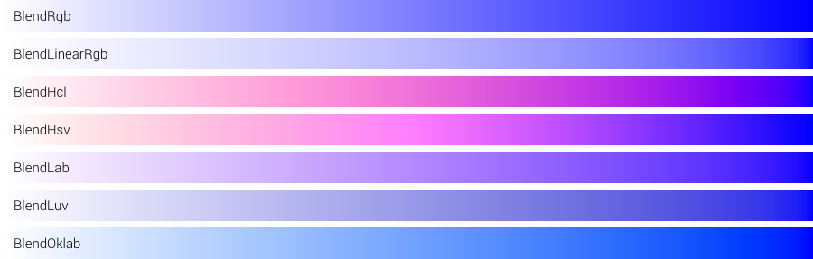
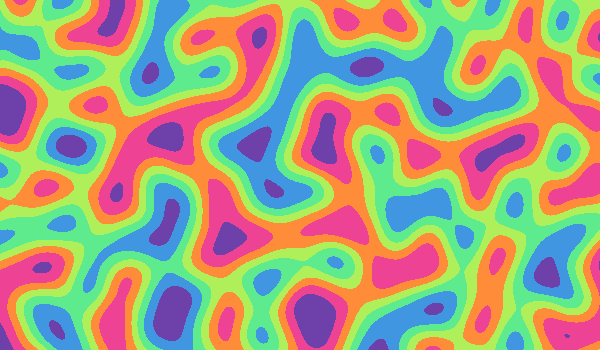

# colorgrad 🎨

[](https://github.com/mazznoer/colorgrad/releases/latest)
[](https://pkg.go.dev/github.com/mazznoer/colorgrad)
[](https://travis-ci.org/mazznoer/colorgrad)
[](https://github.com/mazznoer/colorgrad/actions)
[](https://goreportcard.com/report/github.com/mazznoer/colorgrad)
[](https://codecov.io/gh/mazznoer/colorgrad)

Go (Golang) _color scales_ library for data visualization, charts, games, maps, generative art and others.

## Support This Project

[](https://liberapay.com/mazznoer/donate)

## Index

* [Custom Gradient](#custom-gradient)
* [Preset Gradients](#preset-gradients)
* [Using the Gradient](#using-the-gradient)
* [Color Schemes](#color-schemes)
* [Examples](#examples)
* [Playground](#playground)

```go
import "github.com/mazznoer/colorgrad"
```

## Custom Gradient

### Basic

```go
grad, err := colorgrad.NewGradient().Build()
```


### Custom Colors

`Colors()` method accept anything that implement [color.Color](https://golang.org/pkg/image/color/#Color) interface.

```go
import "image/color"
import "github.com/lucasb-eyer/go-colorful"

grad, err := colorgrad.NewGradient().
    Colors(
        color.RGBA{0, 206, 209, 255},
        color.RGBA{255, 105, 180, 255},
        colorful.Color{R: 0.274, G: 0.5, B: 0.7},
        colorful.Hsv(50, 1, 1),
        colorful.Hsv(348, 0.9, 0.8),
    ).
    Build()
```


### Using Web Color Format

`HtmlColors()` method accepts [named colors](https://www.w3.org/TR/css-color-4/#named-colors), hexadecimal (`#rgb`, `#rgba`, `#rrggbb`, `#rrggbbaa`), `rgb()`, `rgba()`, `hsl()`, `hsla()`, `hwb()`, and `hsv()`.

```go
grad, err := colorgrad.NewGradient().
    HtmlColors("#C41189", "#00BFFF", "#FFD700").
    Build()
```


```go
grad, err := colorgrad.NewGradient().
    HtmlColors("gold", "hotpink", "darkturquoise").
    Build()
```


```go
grad, err := colorgrad.NewGradient().
    HtmlColors(
        "rgb(125,110,221)",
        "rgb(90%,45%,97%)",
        "hsl(229,79%,85%)",
    ).
    Build()
```


### Domain & Color Position

Default domain is [0..1].

```go
grad, err := colorgrad.NewGradient().
    HtmlColors("deeppink", "gold", "seagreen").
    Build()
```


Set the domain to [0..100].

```go
grad, err := colorgrad.NewGradient().
    HtmlColors("deeppink", "gold", "seagreen").
    Domain(0, 100).
    Build()
```


Set the domain to [-1..1].

```go
grad, err := colorgrad.NewGradient().
    HtmlColors("deeppink", "gold", "seagreen").
    Domain(-1, 1).
    Build()
```


Set exact position for each color. The domain is [0..1].

```go
grad, err := colorgrad.NewGradient().
    HtmlColors("deeppink", "gold", "seagreen").
    Domain(0, 0.7, 1).
    Build()
```


Set exact position for each color. The domain is [15..80].

```go
grad, err := colorgrad.NewGradient().
    HtmlColors("deeppink", "gold", "seagreen").
    Domain(15, 30, 80).
    Build()
```


### Blending Mode

```go
grad, err := colorgrad.NewGradient().
    HtmlColors("#FFF", "#00F").
    Mode(colorgrad.BlendRgb).
    Build()
```


## Preset Gradients

All preset gradients are in the domain [0..1].

### Diverging

`colorgrad.BrBG()`


`colorgrad.PRGn()`


`colorgrad.PiYG()`


`colorgrad.PuOr()`


`colorgrad.RdBu()`


`colorgrad.RdGy()`


`colorgrad.RdYlBu()`


`colorgrad.RdYlGn()`


`colorgrad.Spectral()`


### Sequential (Single Hue)

`colorgrad.Blues()`


`colorgrad.Greens()`


`colorgrad.Greys()`


`colorgrad.Oranges()`


`colorgrad.Purples()`


`colorgrad.Reds()`


### Sequential (Multi-Hue)

`colorgrad.Turbo()`


`colorgrad.Viridis()`


`colorgrad.Inferno()`


`colorgrad.Magma()`


`colorgrad.Plasma()`


`colorgrad.Cividis()`


`colorgrad.Warm()`


`colorgrad.Cool()`


`colorgrad.CubehelixDefault()`


`colorgrad.BuGn()`


`colorgrad.BuPu()`


`colorgrad.GnBu()`


`colorgrad.OrRd()`


`colorgrad.PuBuGn()`


`colorgrad.PuBu()`


`colorgrad.PuRd()`


`colorgrad.RdPu()`


`colorgrad.YlGnBu()`


`colorgrad.YlGn()`


`colorgrad.YlOrBr()`


`colorgrad.YlOrRd()`


### Cyclical

`colorgrad.Rainbow()`


`colorgrad.Sinebow()`


## Using the Gradient

### Get the domain

```go
grad := colorgrad.Rainbow()

fmt.Println(grad.Domain()) // 0 1
```

### Get single color at certain position

```go
grad := colorgrad.Rainbow()

fmt.Println(grad.At(0.0).Hex()) // #6e40aa
fmt.Println(grad.At(0.5).Hex()) // #aff05b
fmt.Println(grad.At(1.0).Hex()) // #6e40aa
```

### Get n colors evenly spaced across gradient

`.Colors()` will return `[]color.Color`.

```go
grad := colorgrad.Rainbow()

for _, c := range grad.Colors(7) {
    fmt.Println(c)
}
```

Output:

```console
{0.43021004989867906 0.25023866753368473 0.6663314402976028}
{0.9324699655386229 0.2641323667713124 0.5856493589115485}
{1 0.5479694546462268 0.220207078599215}
{0.68717707266999 0.9403236324800919 0.355050281779196}
{0.36562500000000014 0.9182994327976323 0.5525738542381139}
{0.25 0.589697182728592 0.877839930901789}
{0.4302100498986791 0.2502386675336847 0.6663314402976028}
```

`.ColorfulColors()` will return `[]colorful.Color`.

```go
grad := colorgrad.Rainbow()

for _, c := range grad.ColorfulColors(10) {
    fmt.Println(c.Hex())
}
```

Output:

```console
#6e40aa
#c83dac
#ff5375
#ff8c38
#c9d33a
#7cf659
#5dea8d
#48b8d0
#4775de
#6e40aa
```

### Hard-Edged Gradient

Convert gradient to hard-edged gradient with 11 segments and 0 smoothness.

```go
grad := colorgrad.Rainbow().Sharp(11, 0)
```


This is the effect of different smoothness.


## Color Schemes

```go
import "github.com/mazznoer/colorgrad/scheme"
```

`scheme.Category10`


`scheme.Accent`


`scheme.Dark2`


`scheme.Paired`


`scheme.Pastel1`


`scheme.Pastel2`


`scheme.Set1`


`scheme.Set2`


`scheme.Set3`


`scheme.Tableau10`


## Examples

### Gradient Image

```go
package main

import (
    "image"
    "image/png"
    "os"

    "github.com/mazznoer/colorgrad"
)

func main() {
    grad, _ := colorgrad.NewGradient().
        HtmlColors("#C41189", "#00BFFF", "#FFD700").
        Build()

    w := 1500
    h := 70
    fw := float64(w)

    img := image.NewRGBA(image.Rect(0, 0, w, h))

    for x := 0; x < w; x++ {
        col := grad.At(float64(x) / fw)
        for y := 0; y < h; y++ {
            img.Set(x, y, col)
        }
    }

    file, err := os.Create("gradient.png")
    if err != nil {
        panic(err.Error())
    }
    defer file.Close()
    png.Encode(file, img)
}
```

Example output:


### Colored Noise

```go
package main

import (
    "image"
    "image/png"
    "os"

    "github.com/mazznoer/colorgrad"
    "github.com/ojrac/opensimplex-go"
)

func main() {
    w := 600
    h := 350
    scale := 0.02

    grad := colorgrad.Rainbow().Sharp(7, 0.2)
    noise := opensimplex.NewNormalized(996)
    img := image.NewRGBA(image.Rect(0, 0, w, h))

    for y := 0; y < h; y++ {
        for x := 0; x < w; x++ {
            t := noise.Eval2(float64(x)*scale, float64(y)*scale)
            img.Set(x, y, grad.At(t))
        }
    }

    file, err := os.Create("noise.png")
    if err != nil {
        panic(err.Error())
    }
    defer file.Close()
    png.Encode(file, img)
}
```

Example output:



## Playground

* [Basic](https://play.golang.org/p/PlMov8BKfRc)
* [Random colors](https://play.golang.org/p/d67x9di4sAF)

## Dependencies

* [colorful](https://github.com/lucasb-eyer/go-colorful)
* [csscolorparser](https://github.com/mazznoer/csscolorparser)

## Inspirations

* [chroma.js](https://gka.github.io/chroma.js/#color-scales)
* [d3-scale-chromatic](https://github.com/d3/d3-scale-chromatic/)
* colorful's [gradientgen.go](https://github.com/lucasb-eyer/go-colorful/blob/master/doc/gradientgen/gradientgen.go)

## Links

* [colorgrad-rs](https://github.com/mazznoer/colorgrad-rs) - Rust port of this library
* [https://www.color-blindness.com/coblis-color-blindness-simulator/](https://www.color-blindness.com/coblis-color-blindness-simulator/)
* [https://github.com/UniStuttgart-VISUS/visual-system-simulator](https://github.com/UniStuttgart-VISUS/visual-system-simulator)
