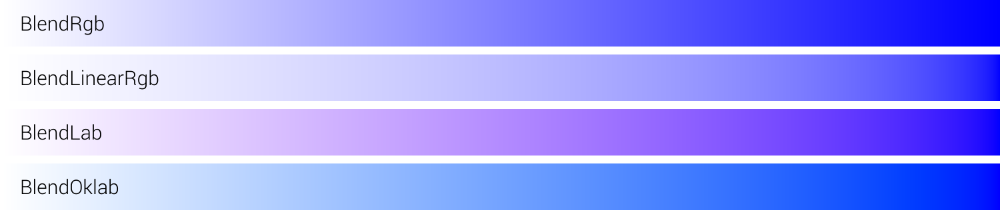
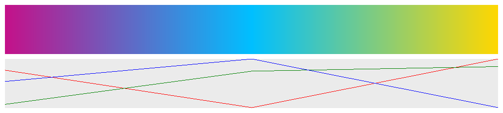
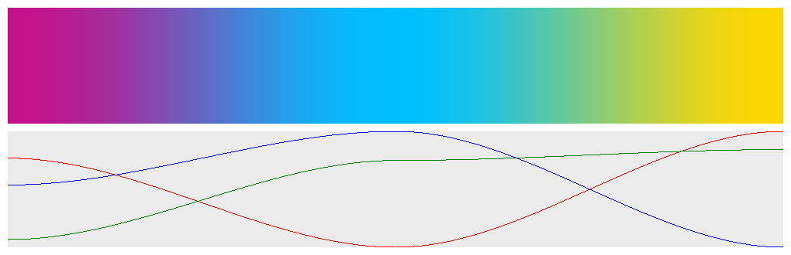
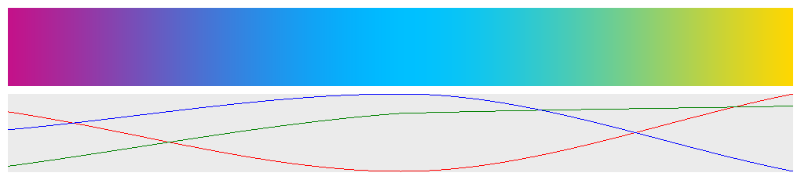
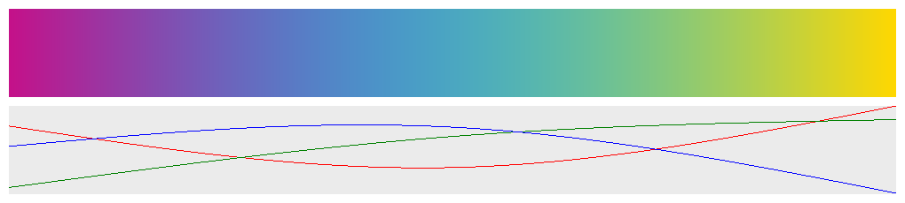

# colorgrad

[](https://github.com/mazznoer/colorgrad/releases/latest)
[](https://pkg.go.dev/github.com/mazznoer/colorgrad)

[](https://goreportcard.com/report/github.com/mazznoer/colorgrad)

Go (Golang) _color scales_ library for data visualization, charts, games, maps, generative art and others.

## Support This Project

[](https://liberapay.com/mazznoer/donate)

## Index

* [Custom Gradient](#custom-gradient)
* [Preset Gradients](#preset-gradients)
* [Using the Gradient](#using-the-gradient)
* [Examples](#examples)
* [Playground](#playground)

```go
import "github.com/mazznoer/colorgrad"
```

## Custom Gradient

### Basic

```go
grad, err := colorgrad.NewGradient().Build()
```


### Custom Colors

```go
grad, err := colorgrad.NewGradient().
    Colors(
        colorgrad.Rgb8(0, 206, 209, 255),
        colorgrad.Rgb8(255, 105, 180, 255),
        colorgrad.Rgb(0.274, 0.5, 0.7, 1),
        colorgrad.Hsv(50, 1, 1, 1),
        colorgrad.Hsv(348, 0.9, 0.8, 1),
    ).
    Build()
```


### Using Web Color Format

`HtmlColors()` method accepts [named colors](https://www.w3.org/TR/css-color-4/#named-colors), hexadecimal (`#rgb`, `#rgba`, `#rrggbb`, `#rrggbbaa`), `rgb()`, `rgba()`, `hsl()`, `hsla()`, `hwb()`, and `hsv()`.

```go
grad, err := colorgrad.NewGradient().
    HtmlColors("#C41189", "#00BFFF", "#FFD700").
    Build()
```


```go
grad, err := colorgrad.NewGradient().
    HtmlColors("gold", "hotpink", "darkturquoise").
    Build()
```


```go
grad, err := colorgrad.NewGradient().
    HtmlColors(
        "rgb(125,110,221)",
        "rgb(90%,45%,97%)",
        "hsl(229,79%,85%)",
    ).
    Build()
```


### Domain & Color Position

Default domain is [0..1].

```go
grad, err := colorgrad.NewGradient().
    HtmlColors("deeppink", "gold", "seagreen").
    Build()
```


Set the domain to [0..100].

```go
grad, err := colorgrad.NewGradient().
    HtmlColors("deeppink", "gold", "seagreen").
    Domain(0, 100).
    Build()
```


Set the domain to [-1..1].

```go
grad, err := colorgrad.NewGradient().
    HtmlColors("deeppink", "gold", "seagreen").
    Domain(-1, 1).
    Build()
```


Set exact position for each color. The domain is [0..1].

```go
grad, err := colorgrad.NewGradient().
    HtmlColors("deeppink", "gold", "seagreen").
    Domain(0, 0.7, 1).
    Build()
```


Set exact position for each color. The domain is [15..80].

```go
grad, err := colorgrad.NewGradient().
    HtmlColors("deeppink", "gold", "seagreen").
    Domain(15, 30, 80).
    Build()
```


### CSS Gradient Format

```go
grad, err := colorgrad.NewGradient().
    Css("deeppink, gold, seagreen").
    Build()
```


```go
grad, err := colorgrad.NewGradient().
    Css("purple, gold 35%, green 35%, 55%, gold").
    Interpolation(colorgrad.InterpolationCatmullRom).
    Build()
```


### Blending Mode

```go
grad, err := colorgrad.NewGradient().
    HtmlColors("#FFF", "#00F").
    Mode(colorgrad.BlendRgb).
    Build()
```


### Interpolation Mode

```go
grad, err := colorgrad.NewGradient().
    HtmlColors("#C41189", "#00BFFF", "#FFD700").
    Interpolation(colorgrad.InterpolationLinear).
    Build()
```

`InterpolationLinear`


`InterpolationSmoothstep`


`InterpolationCatmullRom`


`InterpolationBasis`


## Preset Gradients

See [PRESET.md](PRESET.md)

## Parsing GIMP Gradient

```go
import "os"

foreground := colorgrad.Rgb(0, 0, 0, 1)
background := colorgrad.Rgb(1, 1, 1, 1)
file, err := os.Open("Abstract_1.ggr")

if err != nil {
	panic(err)
}

defer file.Close()
grad, name, err2 := colorgrad.ParseGgr(file, foreground, background)
fmt.Println(name) // Abstract 1
```


## Using the Gradient

### Get the domain

```go
grad := colorgrad.Rainbow()

fmt.Println(grad.Domain()) // 0 1
```

### Get single color at certain position

```go
grad := colorgrad.Rainbow()

fmt.Println(grad.At(0.0).HexString()) // #6e40aa
fmt.Println(grad.At(0.5).HexString()) // #aff05b
fmt.Println(grad.At(1.0).HexString()) // #6e40aa
```

### Get n colors evenly spaced across gradient

```go
grad := colorgrad.Rainbow()

for _, c := range grad.Colors(10) {
    fmt.Println(c.HexString())
}
```

Output:

```console
#6e40aa
#c83dac
#ff5375
#ff8c38
#c9d33a
#7cf659
#5dea8d
#48b8d0
#4775de
#6e40aa
```

### Hard-Edged Gradient

Convert gradient to hard-edged gradient with 11 segments and 0 smoothness.

```go
grad := colorgrad.Rainbow().Sharp(11, 0)
```


This is the effect of different smoothness.


## Examples

### Gradient Image

```go
package main

import (
    "image"
    "image/png"
    "os"

    "github.com/mazznoer/colorgrad"
)

func main() {
    grad, _ := colorgrad.NewGradient().
        HtmlColors("#C41189", "#00BFFF", "#FFD700").
        Build()

    w := 1500
    h := 70
    fw := float64(w)

    img := image.NewRGBA(image.Rect(0, 0, w, h))

    for x := 0; x < w; x++ {
        col := grad.At(float64(x) / fw)
        for y := 0; y < h; y++ {
            img.Set(x, y, col)
        }
    }

    file, err := os.Create("gradient.png")
    if err != nil {
        panic(err.Error())
    }
    defer file.Close()
    png.Encode(file, img)
}
```

Example output:


### Colored Noise

```go
package main

import (
    "image"
    "image/png"
    "os"

    "github.com/mazznoer/colorgrad"
    "github.com/ojrac/opensimplex-go"
)

func main() {
    w := 600
    h := 350
    scale := 0.02

    grad := colorgrad.Rainbow().Sharp(7, 0.2)
    noise := opensimplex.NewNormalized(996)
    img := image.NewRGBA(image.Rect(0, 0, w, h))

    for y := 0; y < h; y++ {
        for x := 0; x < w; x++ {
            t := noise.Eval2(float64(x)*scale, float64(y)*scale)
            img.Set(x, y, grad.At(t))
        }
    }

    file, err := os.Create("noise.png")
    if err != nil {
        panic(err.Error())
    }
    defer file.Close()
    png.Encode(file, img)
}
```

Example output:


## Playground

* [Basic](https://play.golang.org/p/PlMov8BKfRc)
* [Random colors](https://play.golang.org/p/d67x9di4sAF)

## Dependencies

* [csscolorparser](https://github.com/mazznoer/csscolorparser)

## Inspirations

* [chroma.js](https://gka.github.io/chroma.js/#color-scales)
* [d3-scale-chromatic](https://github.com/d3/d3-scale-chromatic/)
* colorful's [gradientgen.go](https://github.com/lucasb-eyer/go-colorful/blob/master/doc/gradientgen/gradientgen.go)

## Links

* [colorgrad-rs](https://github.com/mazznoer/colorgrad-rs) - Rust port of this library
