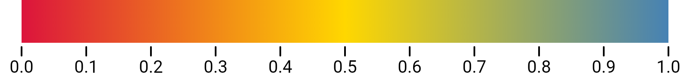
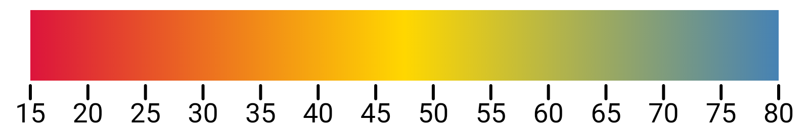
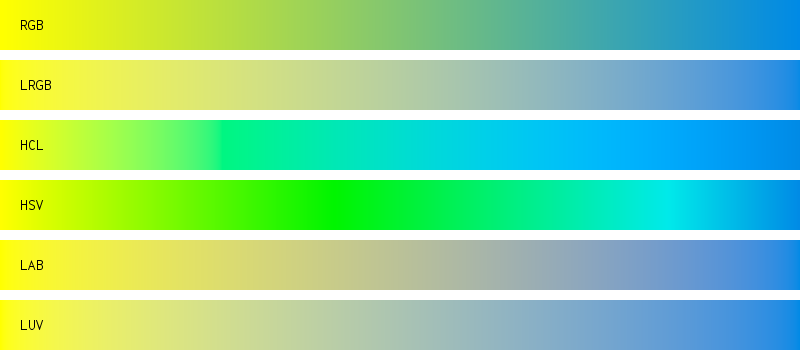
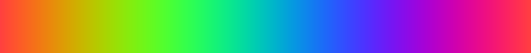
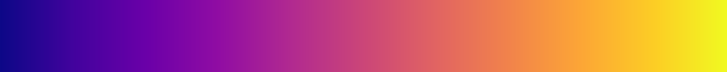
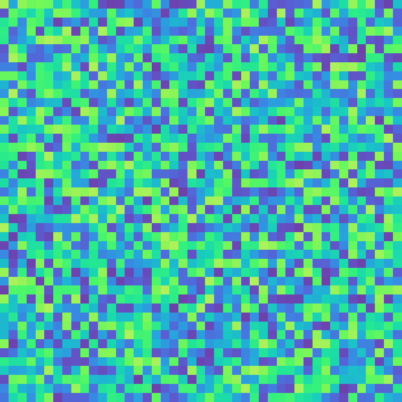

# colorgrad 🎨

[](https://pkg.go.dev/github.com/mazznoer/colorgrad?tab=doc)

Fun & easy way to create _color gradient_ / _color scales_ in __Go__ (__Golang__).



### Usages

#### Basic

```go
import "github.com/mazznoer/colorgrad"
```

```go
grad, err := colorgrad.NewGradient().Build()

if err != nil {
    panic(err)
}

// Get single color at certain position.
grad.At(0) // colorful.Color
grad.At(0.5).Hex() // hex color string
grad.At(1)

// Get n colors evenly spaced across gradient.
grad.Colors(27) // []colorful.Color
colorgrad.IntoColors(grad.Colors(10)) // []color.Color
```


#### Custom Colors

`Colors()` method accept anything that implement [color.Color](https://golang.org/pkg/image/color/#Color) interface.

```go
import "image/color"
import "github.com/lucasb-eyer/go-colorful"

grad, err := colorgrad.NewGradient().
    Colors(
        color.RGBA{255, 0, 255, 255},
        color.Gray{100},
        color.White,
        colorful.Hsv(210, 1, 0.8),
    ).
    Build()
```


#### Using Hex Colors

```go
grad, err := colorgrad.NewGradient().
    HexColors("#B22222", "#FFD700", "#2E8B57").
    Build()
```


#### Custom Domain

```go
grad, err := colorgrad.NewGradient().
    HexColors("#DC143C", "#FFD700", "#4682b4").
    Domain(15, 47.5, 80).
    Build()
```


#### Blending Mode

```go
grad, err := colorgrad.NewGradient().
    HexColors("#ff0", "#008ae5").
    Mode(colorgrad.LRGB).
    Build()
```


### Preset Gradients

```go
grad := colorgrad.Rainbow()
grad.At(t) // t in the range 0..1
grad.Colors(15)
```

`grad := colorgrad.Turbo()`


`grad := colorgrad.Warm()`


`grad := colorgrad.Cool()`


`grad := colorgrad.Rainbow()`


`grad := colorgrad.Sinebow()`


`grad := colorgrad.Spectral()`


`grad := colorgrad.Viridis()`


`grad := colorgrad.Magma()`


`grad := colorgrad.Plasma()`


`grad := colorgrad.Inferno()`


`grad := colorgrad.Cividis()`


`grad := colorgrad.Blues()`


`grad := colorgrad.Greens()`


`grad := colorgrad.Oranges()`


`grad := colorgrad.Purples()`


`grad := colorgrad.Reds()`


`grad := colorgrad.Greys()`


### Random Colors


[Try it online](https://play.golang.org/p/d67x9di4sAF)

### Online Playground

[Try it online](https://play.golang.org/p/rE8OI50PsQA)

### Dependencies

* [colorful](https://github.com/lucasb-eyer/go-colorful)

### Inspirations

* [chroma.js](https://github.com/gka/chroma.js)
* [d3-scale-chromatic](https://github.com/d3/d3-scale-chromatic/)
