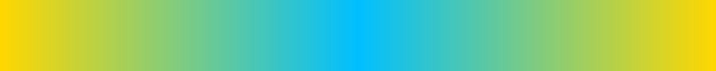
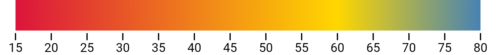
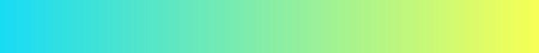
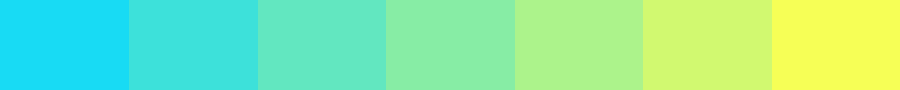
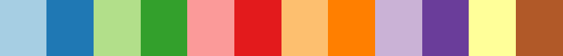
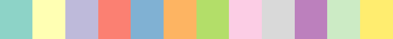
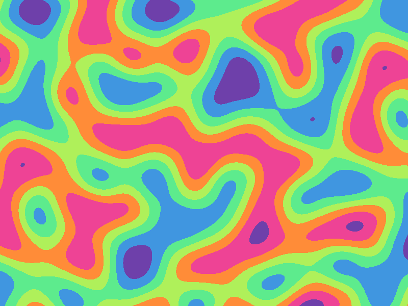

# colorgrad 🎨

[](https://pkg.go.dev/github.com/mazznoer/colorgrad?tab=doc)
[](https://travis-ci.org/mazznoer/colorgrad)
[](https://github.com/mazznoer/colorgrad/actions)
[](https://goreportcard.com/report/github.com/mazznoer/colorgrad)
[](https://codecov.io/gh/mazznoer/colorgrad)

Fun & easy way to create _color gradient_ / _color scales_ in __Go__ (__Golang__).


### Index

* [Usages](#usages)
  - [Basic](#basic)
  - [Custom Colors](#custom-colors)
  - [Hex Colors](#using-hex-colors)
  - [Named Colors](#named-colors)
  - [Custom Domain](#custom-domain)
  - [Blending Mode](#blending-mode)
  - [Invalid RGB](#beware-of-invalid-rgb-color)
  - [Hard-Edged Gradient](#hard-edged-gradient)
* [Preset Gradients](#preset-gradients)
* [Color Scheme](#color-scheme)
* [Gallery](#gallery)
* [Playground](#playground)
* [Dependencies](#dependencies)
* [Inspirations](#inspirations)

### Usages

#### Basic

```go
import "github.com/mazznoer/colorgrad"
```

```go
grad, err := colorgrad.NewGradient().Build()

if err != nil {
    panic(err)
}

dmin, dmax := grad.Domain()

// Get single color at certain position.
// t in the range dmin..dmax (default to 0..1)
c1 := grad.At(t)       // colorful.Color
c2 := grad.At(t).Hex() // hex color string
var c3 color.Color = grad.At(t) // color.Color

// Get n colors evenly spaced across gradient.
colors1 := grad.ColorfulColors(9) // []colorful.Color
colors2 := grad.Colors(23)        // []color.Color
```


#### Custom Colors

`Colors()` method accept anything that implement [color.Color](https://golang.org/pkg/image/color/#Color) interface.

```go
import "image/color"
import "github.com/lucasb-eyer/go-colorful"

grad, err := colorgrad.NewGradient().
    Colors(
        color.RGBA{0, 206, 209, 255},
        color.RGBA{255, 105, 180, 255},
        colorful.Color{R: 0.274, G: 0.5, B: 0.7},
        colorful.Hsv(50, 1, 1),
        colorful.Hsv(348, 0.9, 0.8),
    ).
    Mode(colorgrad.HCL).
    Build()
```


#### Using Hex Colors

```go
grad, err := colorgrad.NewGradient().
    HtmlColors("#FFD700", "#00BFFF", "#FFD700").
    Build()
```


#### Named Colors

We can also use named colors as defined in the SVG 1.1 spec.

```go
grad, err := colorgrad.NewGradient().
    HtmlColors("gold", "hotpink", "darkturquoise").
    Build()
```


#### Custom Domain

```go
grad, err := colorgrad.NewGradient().
    HtmlColors("#DC143C", "#FFD700", "#4682b4").
    Build()
```


```go
grad, err := colorgrad.NewGradient().
    HtmlColors("#DC143C", "#FFD700", "#4682b4").
    Domain(0, 0.35, 1).
    Build()
```


```go
grad, err := colorgrad.NewGradient().
    HtmlColors("#DC143C", "#FFD700", "#4682b4").
    Domain(15, 60, 80).
    Build()

grad.At(15).Hex() // #DC143C
grad.At(75)
grad.At(80).Hex() // #4682b4
```


#### Blending Mode

```go
grad, err := colorgrad.NewGradient().
    HtmlColors("#ff0", "#008ae5").
    Mode(colorgrad.LRGB).
    Build()
```


#### Beware of Invalid RGB Color
Read it [here](https://github.com/lucasb-eyer/go-colorful#blending-colors).

```go
grad, err := colorgrad.NewGradient().
    HtmlColors("#DC143C", "#FFD700", "#4682b4").
    Mode(colorgrad.HCL).
    Build()

grad.At(t) // might get invalid RGB color
grad.At(t).Clamped() // return closest valid RGB color
```

Without `Clamped()`


With `Clamped()`


#### Hard-Edged Gradient

```go
grad1, err := colorgrad.NewGradient().
    HtmlColors("#18dbf4", "#f6ff56").
    Domain(0, 100).
    Build()
```


```go
grad2 := grad1.Sharp(7)

dmin, dmax := grad2.Domain() // 0, 100 -- same as original gradient
```


### Preset Gradients

```go
grad := colorgrad.Rainbow()

c := grad.At(t) // t in the range 0..1
colors1 := grad.ColorfulColors(5)
colors2 := grad.Colors(17)
grad2 := grad.Sharp(13)
```

#### Diverging

`colorgrad.BrBG()`


`colorgrad.PRGn()`


`colorgrad.PiYG()`


`colorgrad.PuOr()`


`colorgrad.RdBu()`


`colorgrad.RdGy()`


`colorgrad.RdYlBu()`


`colorgrad.RdYlGn()`


`colorgrad.Spectral()`


#### Sequential (Single Hue)

`colorgrad.Blues()`


`colorgrad.Greens()`


`colorgrad.Greys()`


`colorgrad.Oranges()`


`colorgrad.Purples()`


`colorgrad.Reds()`


#### Sequential (Multi-Hue)

`colorgrad.Turbo()`


`colorgrad.Viridis()`


`colorgrad.Inferno()`


`colorgrad.Magma()`


`colorgrad.Plasma()`


`colorgrad.Cividis()`


`colorgrad.Warm()`


`colorgrad.Cool()`


`colorgrad.CubehelixDefault()`


#### Cyclical

`colorgrad.Rainbow()`


`colorgrad.Sinebow()`


### Color Scheme

`colorgrad.Scheme.Accent`


`colorgrad.Scheme.Category10`


`colorgrad.Scheme.Dark2`


`colorgrad.Scheme.Paired`


`colorgrad.Scheme.Pastel1`


`colorgrad.Scheme.Pastel2`


`colorgrad.Scheme.Set1`


`colorgrad.Scheme.Set2`


`colorgrad.Scheme.Set3`


### Gallery

Noise + hard-edged gradient


Random _cool_ colors


### Playground

* [Basic](https://play.golang.org/p/qoUQvzOkceg)
* [Random colors](https://play.golang.org/p/d67x9di4sAF)

### Dependencies

* [colorful](https://github.com/lucasb-eyer/go-colorful)

### Inspirations

* [chroma.js](https://github.com/gka/chroma.js)
* [d3-scale-chromatic](https://github.com/d3/d3-scale-chromatic/)
* colorful's [gradientgen.go](https://github.com/lucasb-eyer/go-colorful/blob/master/doc/gradientgen/gradientgen.go)

